# PPS-Unidad1Actividad1-AdrianCurtoSanchez

1. [Explicación del comando de ejecución de Docker](#explicación-del-comando-de-ejecución-de-docker)
2. [Instalación de extensiones](#Instalación de extensiones)
3. [Prueba de entornos](#Prueba de entornos)


## 1. Explicación del comando de ejecución de Docker
Deberemos crear las carpetas donde se almacenarán los datos:
```
sudo mkdir -p  $HOME/docker/eclipse/datos
sudo chown -R $(whoami) $HOME/docker/eclipse
sudo chgrp -R $(whoami) $HOME/docker/eclipse
```
Inicializar la variable `$DISPLAY` ejecutando en la terminar:
```
export DISPLAY=:0
```
Una vez inicializada la variable ejecutaremos el contendor con el entorno de desarrollo:

```
docker run -ti --rm -e DISPLAY=$DISPLAY -e artifactory_host='10.0.11.8:8080' --name eclipse -v /tmp/.X11-unix:/tmp/.X11-unix -v `pwd`:/workspace -v $HOME/docker/eclipse/datos:/home/developer dockeruc/eclipse	
```

El parámetro `-ti` indica que el container ejecutará una terminal interactiva.

El parámetro `--rm` se emplea en contenedores que tras realizar su cometido y finalizar se eliminará de forma automática.

La variable de entorno `DISPLAY=$DISPLAY` asocia a la variable DISPLAY el servicio grafico Xorg.

La variable de entorno `artifactory_host='IP:PUERTO'` asocia la variable atifactory_host la IP de nuestro equipo y el puerto indicado del servicio de entorno gráfico del sistema oprativo(Windows).

El parametro `--name eclipse` establece el nombre del contenedor a "eclipse"

El volumen de tipo bind `-v /tmp/.X11-unix:/tmp/.X11-unix` enlaza la carpeta del equipo host "/tmp/.X11-unix" con la carpeta del contenedor "/tmp/.X11-unix".

El volumen de docker "pwd" `-v `pwd`:/workspace` se enlaza con el directorio del contenedor "/workspace".

El volumen de tipo bind `-v $HOME/docker/eclipse/datos:/home/developer` enlaza la carpeta del equipo host "/home/user/docker/eclipse/datos" con la carpeta del contenedor "/home/developer".


## 2. Instalación de extensiones

En mi caso empleo como ide [VSCodium](https://vscodium.com/) una versión de [VSCode]() mantenida por la comunidad sin el tracking implementado por parte de Microsoft. Lo he intalado haciendo uso del gestor de paquetes de linux [FLatpak](https://flatpak.org/).
Una peculiaridad de este IDE es que no implementa el repositorio de extensiones de Microsoft, sino que implementa el repositorio libre [Open VSX](https://open-vsx.org/) de la comunidad de Eclipse.

Para instalar una extensión solo tenemos que pinchar en el icono inferior que aparece en el menú de la izquierda.

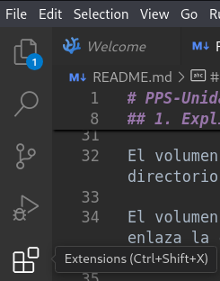

En la ventana de la izquierda disponemos de un buscador de extensiones en el que introduciremos el nombre de la extensión, en este caso "SonarLint". Pinchamos sobre la extensión y nos muestra en una ventana más información sobre esta, encontrandose también un botón para instalarla directamente. 

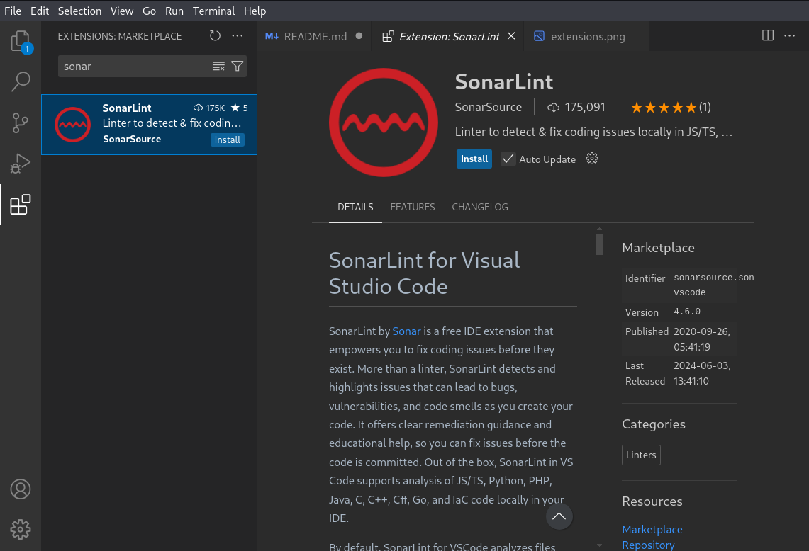

Una vez instalada podemos observar que podemos deshabilitar y desinstalar la extensión.

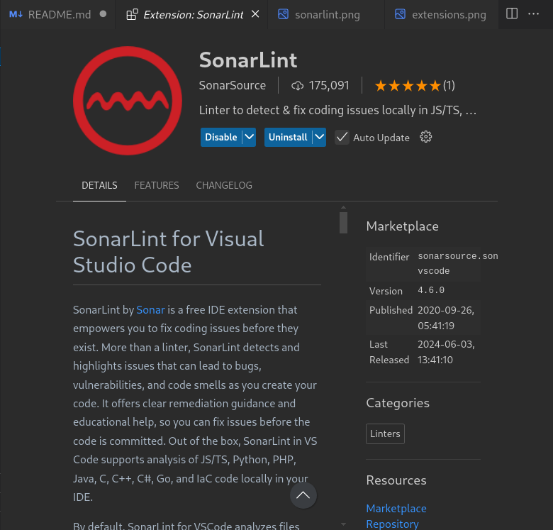

Si por un casual este ropositorio no cuenta con alguna extensión que deseamos siempre podemos ir al [marketplace de Microsoft](https://marketplace.visualstudio.com/vscode) y descargarla e importarla de forma manual. Para ello buscaremos la extensión deseada en este caso la de Python como ejemplo.

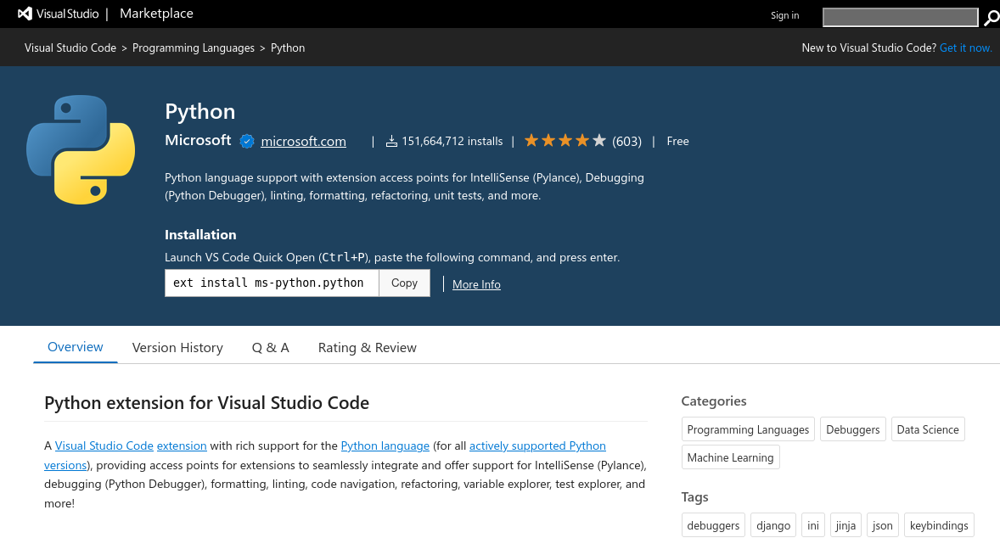

Accedemos a la pestaña de "Version History" y descargamos la última versión para nuestro sistema operativo.

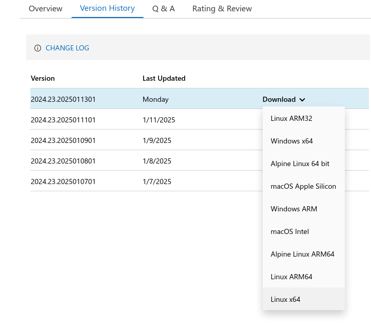

En VSCodium vamos a las extensiones y pinchamos en los tres puntitos refentes a más acciones sobre las extensiones.

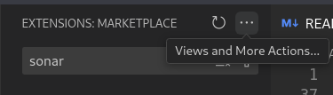

Y pinchamos sobre "Intall from VSIX..."

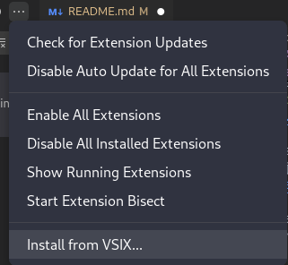

Tras seleccionar el fichero descargado, se intala la extensión y podremos verla en las extensiones instaladas.

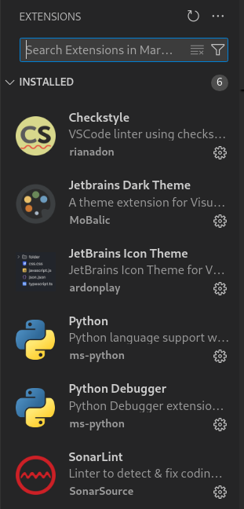

## 3. Prueba de entornos

Al abrir uno de los scripts de python inmediatamente SonarLint nos informa de ciertos problemas en el código que podemos corregir, marcandolos en el propio código como se puede apreciar en la captura de pantalla.

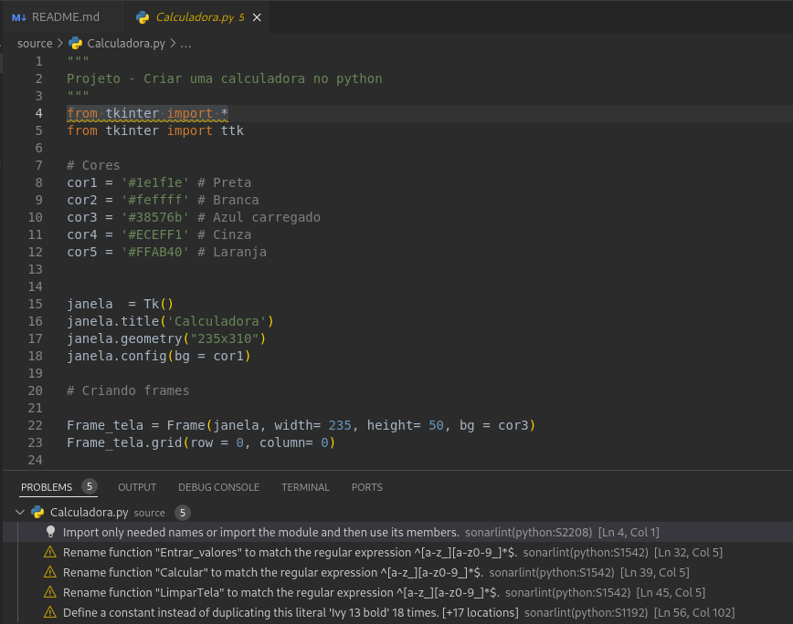

Podemos ejecutar el script fácilmente clicando en el icono de play de la parte superior derecha.

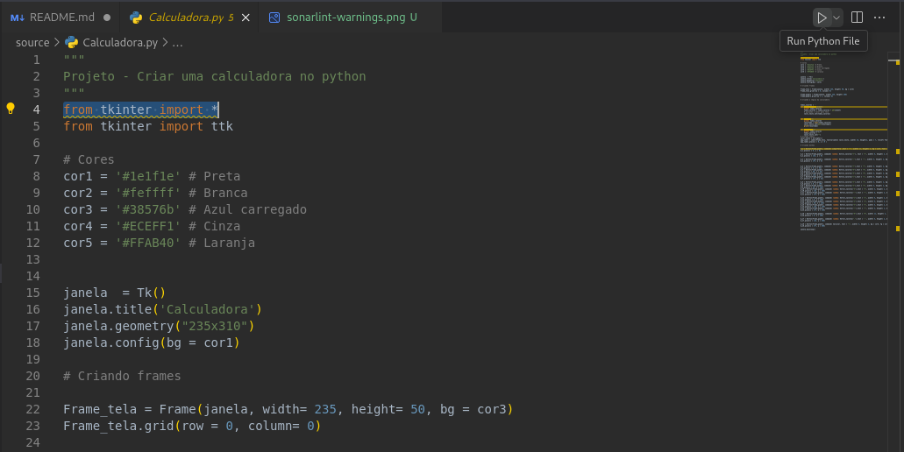

Vemos como se ejecuta el script de forma automática desde la terminal, pudiendo interactuar con la interfaz gráfica del programa python.

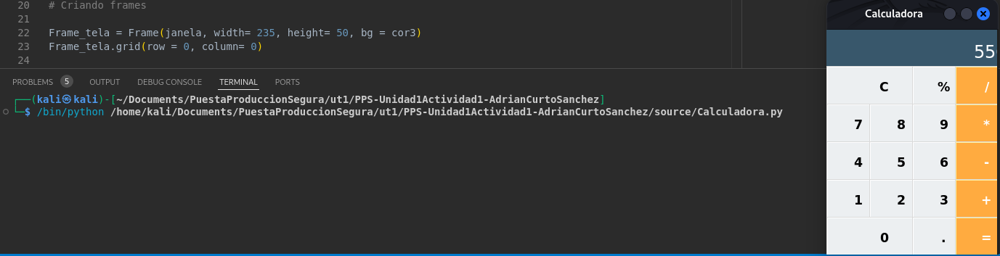

También tenemos la posibilidad de depurar el código estableciendo puntos de ruptura en los que se detendrá la ejecución para poder analizar variables.

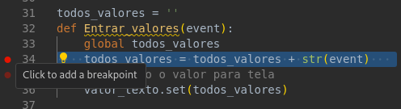

Para que se detenga la ejecución del código en los putnos de ruptura deberemos ejecutar el código en modo debug. Al lado del icono de play tenemos un desplegable en el que nos permite ejecutar el modo debug.

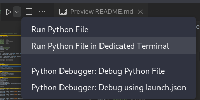

Como se puede observar en la ejecucuión de debug nos indica la línea del punto de ruptura y en el menú de la izquierda pedemos ver los valores de las variabes. En la parte superior encontramos iconos que nos permiten seguir ejecutando el código por líneas, bloques, reiniciar la ejecución, parar la ejecución o continuar la ejecución.

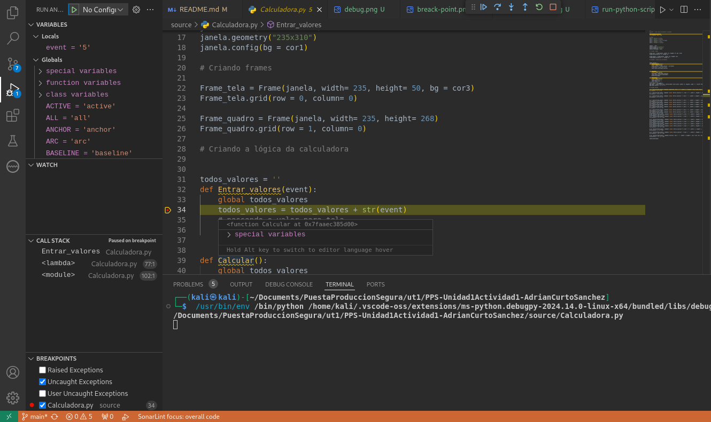
